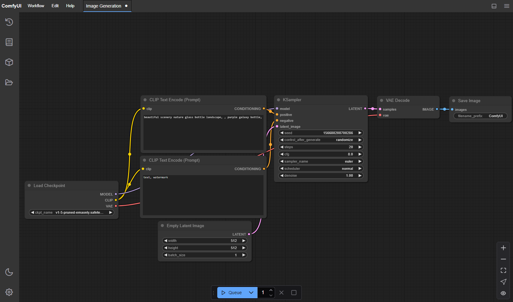

# Stable Diffusion

Stable Diffusion 是一种基于扩散技术的深度学习文本生成图像模型，于2022年发布。这项生成式人工智能技术是Stability AI的旗舰产品，被认为是当前人工智能热潮的一部分。

它主要用于根据文本描述生成细节丰富的图像，但也可以应用于其他任务，如图像修复、图像扩展以及基于文本提示的图像到图像转换。其开发涉及慕尼黑路德维希·马克西米利安大学CompVis小组和Runway的研究人员，并得到了Stability的计算资源捐赠以及非营利组织提供的训练数据支持。

Stable Diffusion 是一种潜在扩散模型，属于深度生成人工神经网络的一种。其代码和模型权重已公开发布，并且可以在配备至少4GB显存的普通消费级GPU上运行。这与之前仅通过云服务访问的专有文本生成图像模型（如DALL-E和MidJourney）形成了鲜明对比。

## 在线使用

- [DreamStudio](https://dreamstudio.ai/)（官方）

- [Stable Diffusion Online](https://stablediffusionweb.com/)

## 本地部署

适用场景: 需要更高自由度或离线使用。

1. **硬件要求：**推荐使用NVIDIA GPU（至少4GB显存）。
2. **安装依赖：**
    - 安装Python（3.8以上版本）。
    - 安装PyTorch（支持GPU版本）。
3. **下载模型：**从Hugging Face或官方GitHub仓库下载Stable Diffusion模型。
4. **运行代码：**使用命令行或脚本运行生成任务。

优点: 完全控制生成过程，支持自定义模型和参数。

### 图形用户界面（GUI）

WebUI 和 ComfyUI 是两种基于 Stable Diffusion 的图形用户界面（GUI），旨在简化图像生成过程，让用户无需编写代码即可轻松使用 Stable Diffusion 的强大功能。

#### WebUI

**AUTOMATIC1111 Stable Diffusion Web UI**（简称 **SD WebUI**、**A1111** 或 **Automatic1111**）是一款开源的生成式人工智能程序，允许用户通过文本提示生成图像。它以 Stable Diffusion 作为基础模型，并提供大量扩展和功能，以自定义生成的图像效果。

#### ComfyUI

**ComfyUI** 是一款开源的节点式程序，允许用户通过一系列文本提示生成图像。它使用 Stable Diffusion 等免费扩散模型作为基础，并结合 ControlNet、LCM 低秩自适应等工具，每个工具在程序中都以节点的形式呈现。