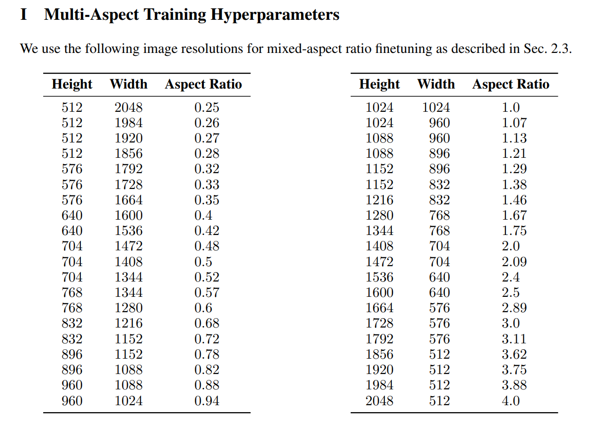

# 图像比例

## SD 1.5

| 比例 | 宽×高            |
| ---- | ---------------- |
| 1:1  | 512×512、768×768 |
| 3:2  | 768x512          |
| 2:3  | 512x768          |
| 4:3  | 768x576          |
| 3:4  | 576x768          |
| 16:9 | 912x512          |
| 9:16 | 512x912          |

## SDXL

[SDXL: Improving Latent Diffusion Models for High-Resolution Image Synthesis**](https://arxiv.org/pdf/2307.01952)

> **I 多方面训练超参数**
>
> 我们使用以下图像分辨率进行混合宽高比微调，如第2.3节所述。

